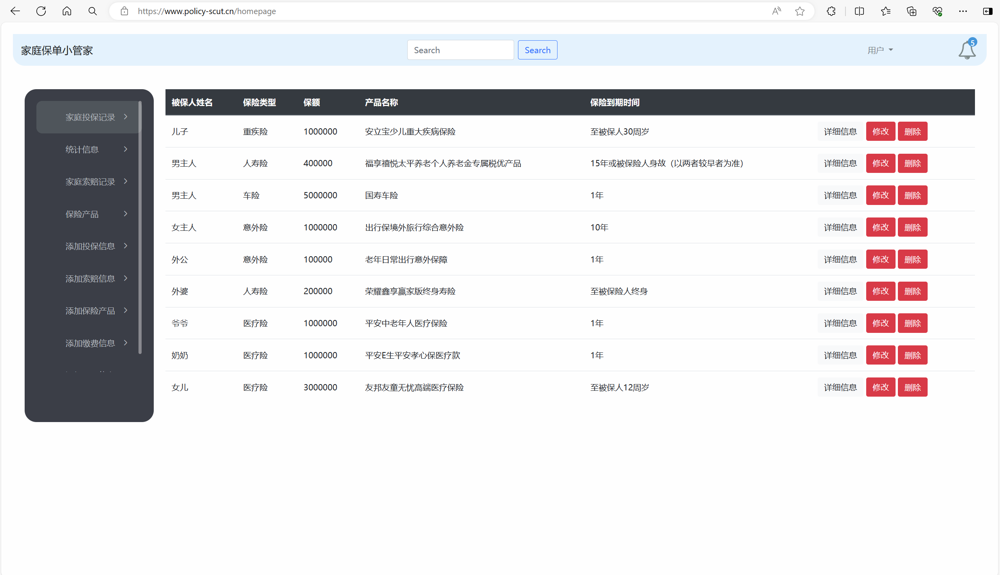
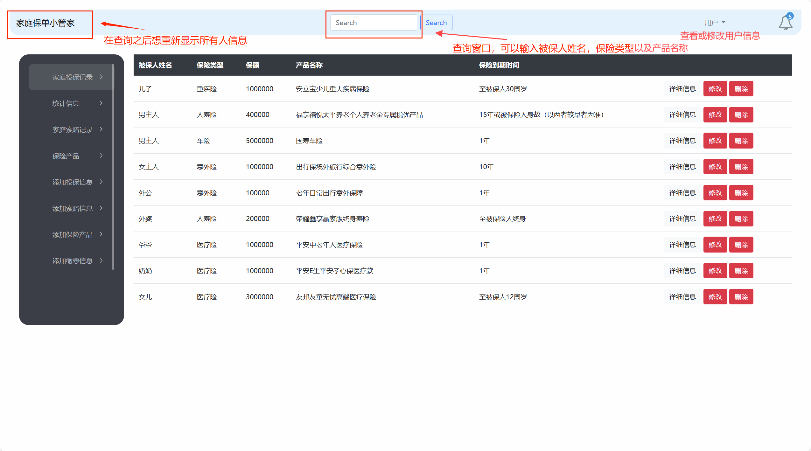
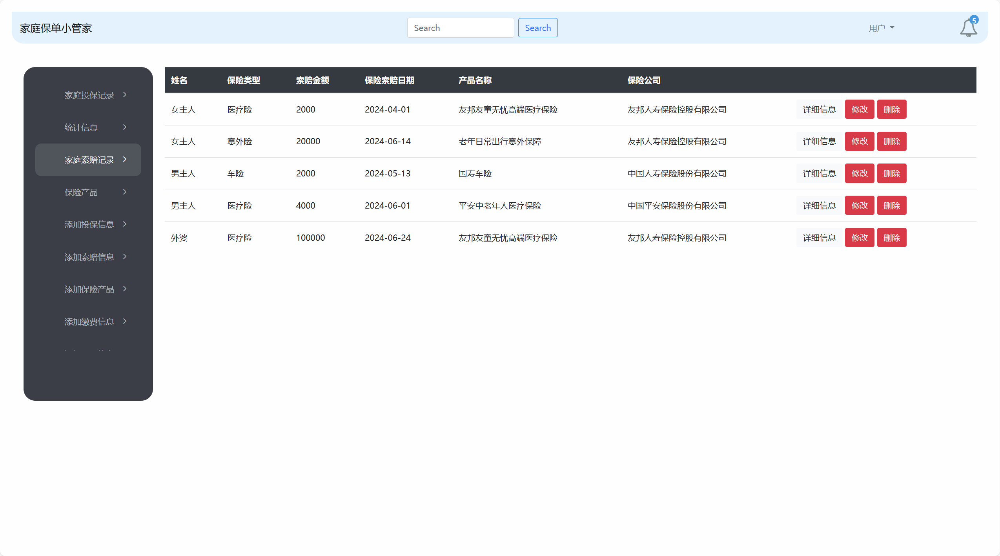
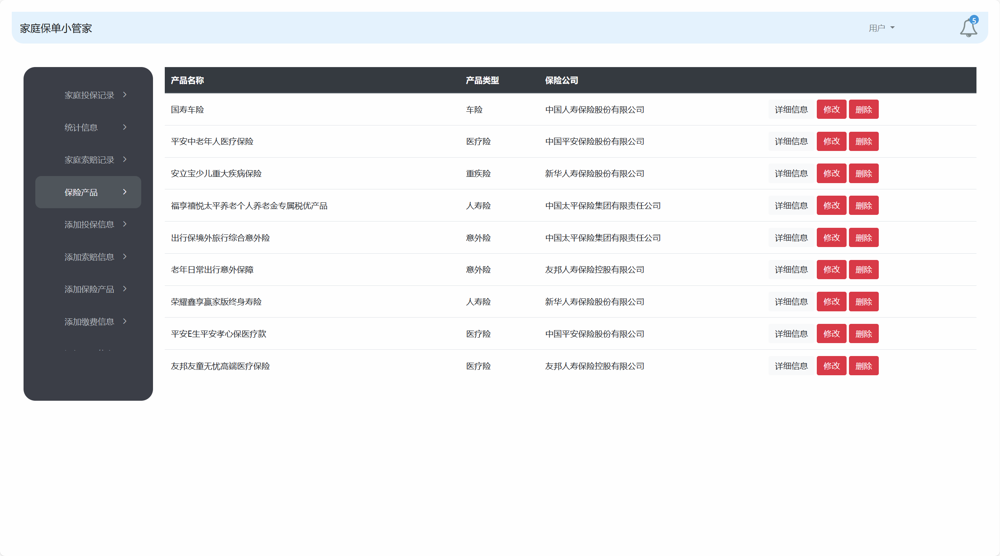
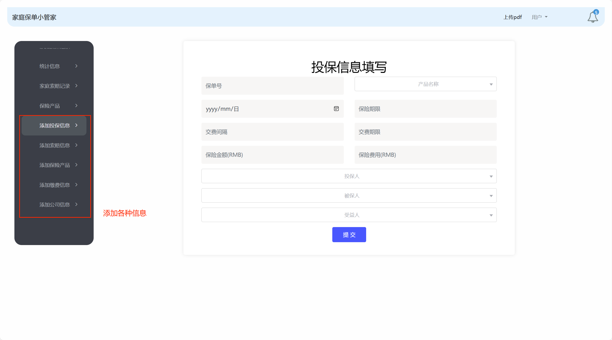
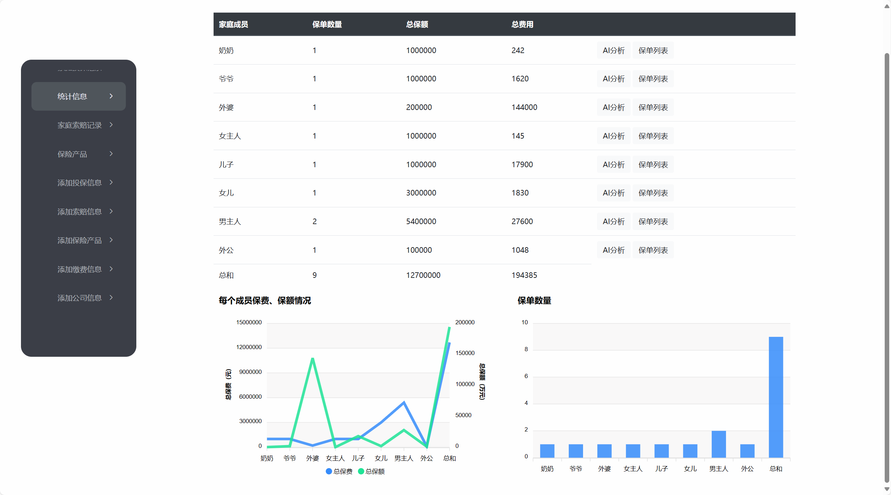
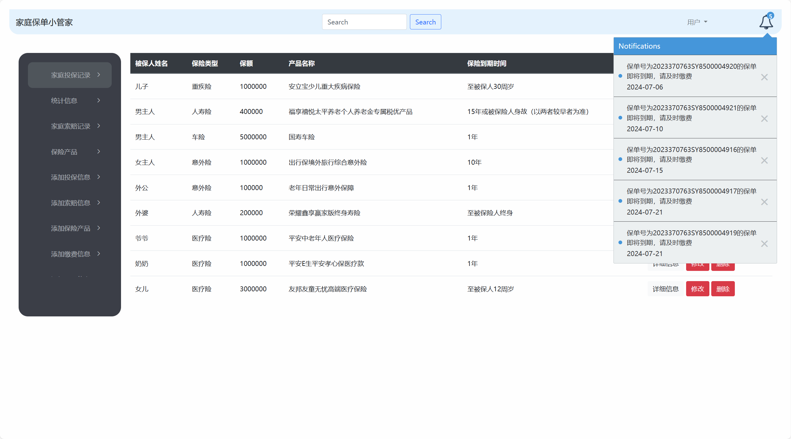
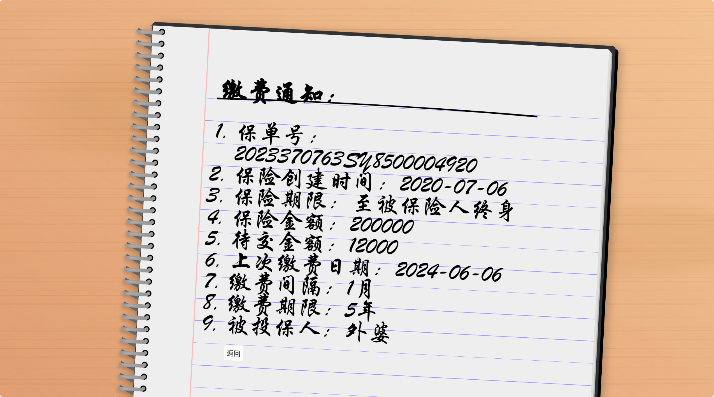
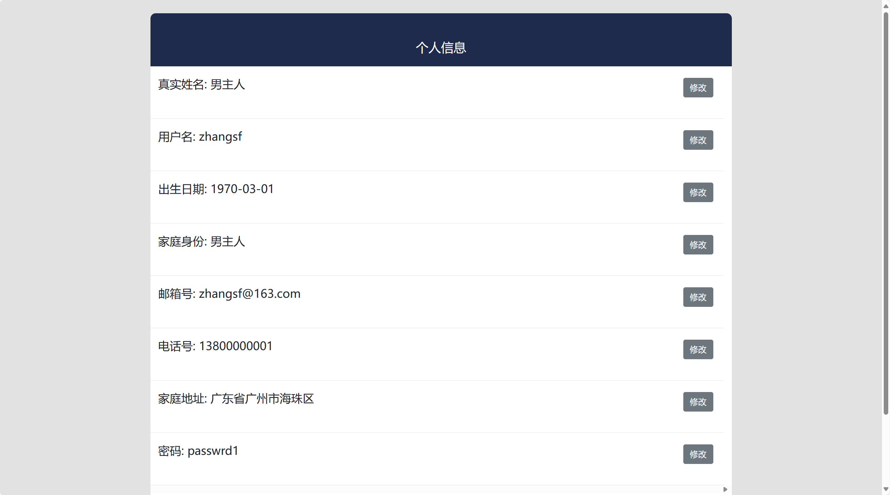
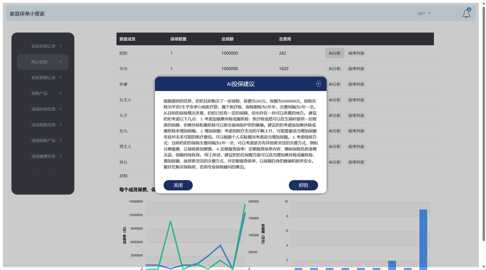

## 家庭保单网页使用方法
1. 进入网页：www.policy-scut.cn (推荐使用google chrome或edge浏览器访问)

登录账号：zhangsf
登录密码：passwrd1

2. 进入主界面

- 主界面操作：

- 家庭索赔界面：

- 所有保险界面：

- 添加信息：

- 统计信息：

- 消息通知：

- 通知详情：

- 个人信息中心：

- AI投保建议：
